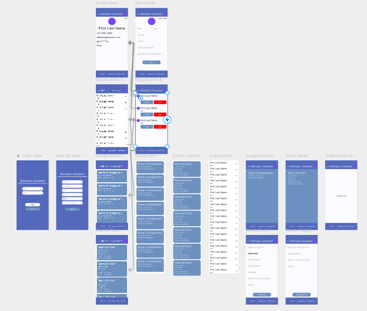
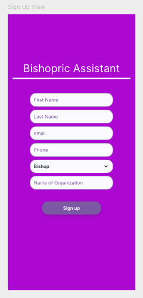
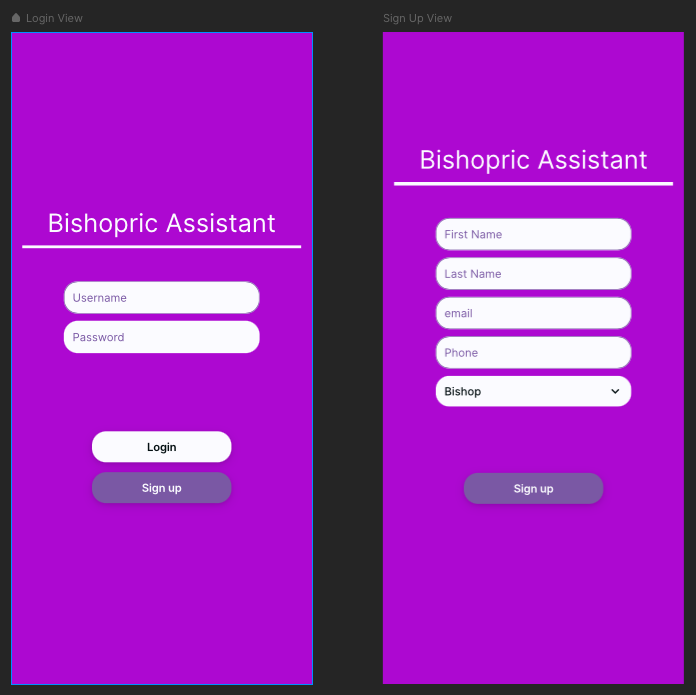

# Bishopric Assistant
Often times in the Church of Jesus Christ of Latter Day Saints Bishoprics are overwhelmed with many different tasks and responsibilities. The intention of this software is to help oliviate some of those stresses and help to organize tasks that need to be done as well as manage assignments, meetings and more.

[Project Link](https://framer.com/projects/Bishopric-Assistant--wzwg61DlBXbe1V1mMWYQ-2tWPm)

## Data Model Structure
```
- Bishopric
    - Members: Class
        - Bishop: Person, Level 1
        - Counselors: List\<Person\>, Level 2
        - Secretaries: List\<Person\>, Level 3
        - Clerks: List\<Person\>, Level 3
        - Ward Counsel Members: List\<Person\>, Level 4
    - Events: Class
        - Meeting: Event
        - Interview: Event
    - Assignments: Class

- Person: Class, Role
    - ID
    - First Name
    - Last Name
    - Email
    - Phone Number
    - Assigned Events List
    - Assigned Assignments List

- Level 1 Clearance: Level 2 Clearance, Level 3 Clearance, Level 4 Clearance
    - Add/Remove any member
    - Creates an organization

- Level 2 Clearance: Level 3 Clearance, Level 4 Clearance
    - Add/Remove Level 3 & 4 Clearance members
    - Can view progress on assignments of any members
    - Can be scheduled interview events

- Level 3 Clearance: Level 4 Clearance
    - Add/Remove Level 2 & 4 Clearance members
    - Create events
    - Create assignments
    - Can cancel events

- Level 4 Clearance
    - Can be scheduled meeting events
    - Can be scheduled assignments
    - Can complete assignments
    - Can view assigned events
    - Can view assigned assignments

- Role
    - Bishop
    - Counselor
    - Secretary
    - Clerk
    - Ward Counsel Member
```
## Functionalities
- Organize Bishopric
    - Create a bishopric account
    - Add/Remove members as they are called and released during the service of a bishop
    - Maintain private information privy to those who should know within the Bishopric
- See avaliability of members in the Bishopric
- Schedule meetings 
    - Assign meeting to specific bishopric member(s)
    - Detail the agenda of the meeting
    - Detail the time and place of the meeting
    - Detail the attendees of the meeting
    - Detail additional notes
    - Detail the type of meeting
    - Detail the name of the meeting
- Assignments
    - Assign assignment to specific member of the bishopric
    - Detail the due date
    - Detail additional notes
    - Detail the name of the assignment
- Limit viewability to specific members
- Allow for multiple Bishoprics usability
- Assign different roles
    - Bishop
        - Full Admin Rights
    - Counselor
        - Partical Admin Rights
    - Secretary
        - Partical Admin Rights
    - Ward Counsel Member
        - Limited Admin Rights/View only
- Notifications
    - Notify assigned users of meetings and assignments
    - Notify assigned users of new meetings and assignments

## Bishopric Organization
The Bishopric will follow this structure, (**NOTE:** the structure also includes viewing clearance):
1. One Bishop 
    - The Bishop has the power to add any members that have requested to join in his organization
    - The Bishop has the power to remove any members from his organization
2. Up to 2 counselors
    - A counselor has the power to add or remove any Secretary or Ward Counsel Member from the organization
3. Zero or more Secretaries & Clerks
    - A Secretary has the power to add or remove any Counselor or Ward Counsel Member from the organization
4. Zero or more Ward Counsel Members

- A member of the organization may view upcoming meetings they have clearance for, special secretaries and clerks may have Bishop level viewing
- Any Meeting or Assignment assigned to a member gives them overriding clearance to see

### Creating a Bishopric
Only a bishop can create an organization.  
Every member in the organization will need to create an account and request too join the Bishops organization.  
The Bishop should first create his account and the organization account, then either request or add users as they are called to the organization.  

## Creating, Scheduling, & Organizing Meetings
### Bishopric Member Avaliability
**Level 2 Clearance Required**  
Counselors and the Bishop will be able to block out or set hours they are avaliable for interiews each day of the week  
Secretaries & Clerks will be able to see Bishop & Counselors avaliability and schedule Meetings in those time slots
Time slots should have a minimum of 15 min increments, multiple time slots may be selected for one event

### Scheduling Events & Assignments
**Level 3 Clearance Required**  
Level 3 and above may create, edit, & assign events to any member of the organization  
Level 3 and above may create, edit, & assign assignments to any member of the organization
#### Event & Assignment Details
Events should include the following:

| Event Detail | Meeting | Interview | Assignment |
|--------------|---------|-----------|------------|
| Name         | X       | X         | X          |
| Time         | X       | X         | X          |
| Date         | X       | X         | X          |
| Place        | X       | X         |            |
| Assignee     | X       | X         | X          |
| Agenda       | X       |           |            |
| Interviewee  |         | X         |            |
| Notes        | X       | X         | X          |
| Notify       | X       | X         | X          |
| Custom Notify| X       | X         | X          |

## Notifications
Members will be notified when a new assignment or event has been assigned to them  
Members will be notified of reminders should they choose to opt in  
Members may choose to recieve a notification via: text, email, or on device  
Members may recieve custom notifications from creator of the event  
Members of Level 3 Clearance may recieve organization access request notifications

## Colors
[Link to Colors](https://coolors.co/071013-e73a23-fbfbff-7192be-5370b9)<br><br>


# Image & Video Reference




