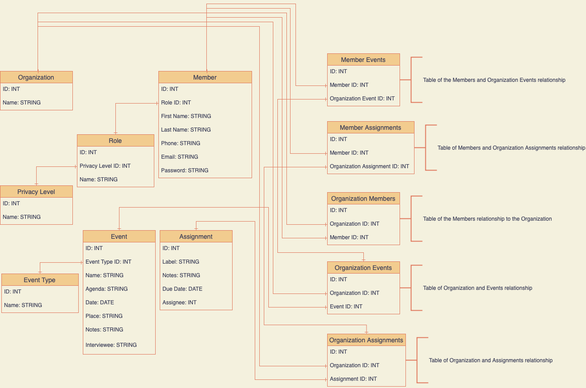
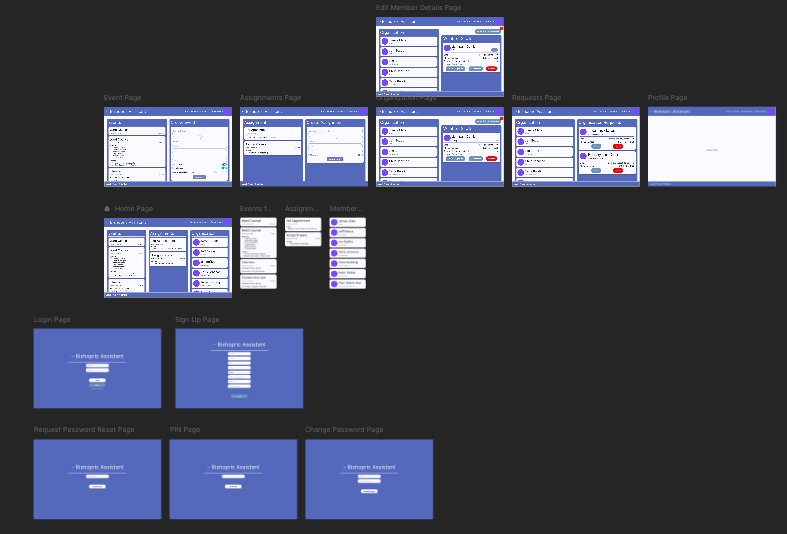
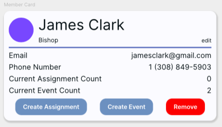

# Bishopric Assistant
Often times in the Church of Jesus Christ of Latter Day Saints Bishoprics are overwhelmed with many different tasks and responsibilities. The intention of this software is to help oliviate some of those stresses and help to organize tasks that need to be done as well as manage assignments, meetings and more.

Find the complete UI mock ups [@Framer.com Project](https://framer.com/projects/Bishopric-Assistant--wzwg61DlBXbe1V1mMWYQ-2tWPm)

<details><summary><h1>Table of Contents</h1></summary>

[TOC]

</details>

<details><summary>

# MVP (Minimum Viable Product)

</summary>

1. Account Creation
   - First Name
   - Last Name
   - Email
     - Username is the users email
     - Not allowed to have the same username as someone else
   - Phone Number
     - Format to look like a phone number +1 (123) 456-4568
   - Role
     - Pulled from database once never again.
   - Create Organization with a Name
     - Option only is displayed if the bishop role is selected
     - Cannot have the same name as another organization
   - Password
     - Does not show the password but instead black circles
     - Must have a number or a symbol
     - Must be at least 8 characters long
   - Confirm Password
     - Shows black circles like password
     - Must match the password
   - General Validation on all fields
     - No empty Fields
   - Saving Account
     - After Validation is complete save the data to the database
     - Return to the login page is successful
     - Remain on the Sign up Page if an error occurred
     - Inform the user of the error with a toast
2. Login with created account
   - Validate username
     - Pull the list of users from the database (This only should happen once per login attempt)
     - If the user is in the database then proceed to validate the password
     - If the user is not in the database then terminate validation and inform the user that the password or username were incorrect
   - Validate password
     - Validate the password from the user given in the database
     - If the password is confirmed, cache the users data in a session proceed to the Home Page
     - If the password fails notify the user that the password or username were incorrect
3. Join an organization
   - If a user has not joined an organization prompt them to by showing a list of organizations that could be joined
   - Organization Card
     - Name of the organization 
     - Name of the bishop of that organization
     - Join organization button
       - Add member to the organizations request list
4. Pages
   - Home
     - View all the events, assignments, and members in the users organization
   - Events
     - Events can be either an interview or a meeting
     - View all events in the users organization
     1. Create an Event
        - Name
        - When (Day and time)
          - Must be a future date
        - Where (Location)
        - Notes (Optional)
        - Event Type (Interview or Meeting)
        1. Create an Interview
           - Only displays if the interview has been selected
           - Who (Assigned to one person)
           - Why (The person who persons being interviewed)
        2. Create a Meeting
           - Only displays if the meeting has been selected
           - Who (Assigned to one or more persons)
           - Why (Agenda of the meeting)
             - If empty replace with "TBD"
     2. Event Validation
        - Only optional fields may remain empty
     3. Save Event
        - Validate
        - Save model in database
        - Connect to Organization
        - Connect to assignee(s)
   - Assignments
     - View all assignments in the users organization
     1. Create an Assignment
        - Name
        - When (Day and Time)
          - Must be a future date
        - Who (Assigned to one person)
        - Notes (Optional)
     2. Validation
        - Only optional fields may remain empty
     3. Save Assignment
        - Validate
        - Save model in database
        - Connect to Organization
        - Connect to assignee
   - Organization
     - View all the members in the users organization
     1. Add a Member to organization
        - Listen actively to changes in the request queue for members that want to join the organization
        - List members that would like to join with option to add or deny request
        - Notify member after request has been denied or accepted
     2. Remove a Member from organization
        - Delete Member from organization in database
5. Analytics
   - Want to know when some thing takes a long time, What is defined as a long time?
   - Want to know when there is a bug, Bug Reporting?
6. Tests
   - Unit tests

</details>
<details><summary>

# Data Model Structure

</summary>



<details><summary>Backends to look into</summary>

- [ ] [Kirtura](https://github.com/Kitura/Kitura)
- [ ] [Vapor](https://github.com/vapor/vapor)
    - [ ] [Leaf](https://github.com/vapor/leaf)
- [ ] [Apple's Focus](https://swift.org/server/)
- [ ] [RW Tutorial](https://www.raywenderlich.com/21799750-templating-vapor-applications-with-leaf)
- [ ] [ADR](https://adr.github.io)
- [ ] [ADL Example](https://adr.github.io/madr/docs/adr/)

</details>

## Firebase
- According to [this article](https://stackoverflow.com/questions/41107699/using-same-firebase-app-with-web-and-mobile-app) a firebase project can be used as a backend to web applicaiton and mobile applications at the same time.
- Potential video from [youtube](https://www.youtube.com/watch?v=xZn0Vzc4uFE) that talks about how to integrate firebase into multiple platforms.
- This backend could potentially assist in a lot fo other ways if the application wanted to be scaled up. One suche example is it will allow the number of users to increase by simply switching to the pay as you use plan offered by firebase with minimal up keep.
- By offering a real time database the users would recieve changes instantly on their devices.

### Pricing **Free Within**
|Authentication|Cloud Firestore|Hosting|Realtime Database|Cloud Storage|Test Lab|
|-|-|-|-|-|-|
|10k/month|Stored Data 1GiB<br>Network egress 10GiB/Month<br>Document writes 20k/day<br>Document reads 50k/day<br>Document deletes 20k/day|Storage 10Gb<br>Data transfer 360MB/day<br>Custom Domain<br>Multiple sites| Simultaneous connections 100<br>GB stored 1GB<br>Gb downloaded<br>10Gb/month<br>Database per project 1|GB stored 5GB<br>GB downloaded 1GB/day<br>Upload operatios 20k/day<br>DownloadOperations 50k/day<br>Buckets per project 1|Virtual Divice Tests 10 tests/day<br>Physical Device Tests 5 tests/day|

## Alternative Databases to Firebase
Based on the following alternatives it would be wise to use Firebase Firestore as wit allows for complex tables to the database and is already integrated into Firebase
- [MySQL](mysql.com) costs money and is only a database needs a server to run on
- [Cloud Firestore](https://firebase.google.com/products/firestore?gclid=Cj0KCQjwu7OIBhCsARIsALxCUaP3cRtbRxYQMtxVvUBaViJtdN7LEiIIJ3HfHvmVfc4tIeB9PNai0NEaAhN6EALw_wcB&gclsrc=aw.ds)(Included in Firebase)
- [Parse](https://docs.parseplatform.org/parse-server/guide/) is similar to firebase uses either MongoDB or Postgres as databases, but still needs a server
- [MongoDB](https://www.mongodb.com) but it is only a database
- [Postgres](https://www.postgresql.org/about/) needs a server to run on

<!-- ```
- Bishopric
    - Members: Class
        - Bishop: Person, Level 1
        - Counselors: List\<Person\>, Level 2
        - Secretaries: List\<Person\>, Level 3
        - Clerks: List\<Person\>, Level 3
        - Ward Counsel Members: List\<Person\>, Level 4
    - Events: Class
        - Meeting: Event
        - Interview: Event
    - Assignments: Class

- Person: Class, Role
    - ID
    - First Name
    - Last Name
    - Email
    - Phone Number
    - Assigned Events List
    - Assigned Assignments List

- Level 1 Clearance: Level 2 Clearance, Level 3 Clearance, Level 4 Clearance
    - Add/Remove any member
    - Creates an organization

- Level 2 Clearance: Level 3 Clearance, Level 4 Clearance
    - Add/Remove Level 3 & 4 Clearance member_domain
    - Can view progress on assignment_domain of any member_domain
    - Can be scheduled interview event_domain

- Level 3 Clearance: Level 4 Clearance
    - Add/Remove Level 2 & 4 Clearance member_domain
    - Create event_domain
    - Create assignment_domain
    - Can cancel event_domain

- Level 4 Clearance
    - Can be scheduled meeting event_domain
    - Can be scheduled assignment_domain
    - Can complete assignment_domain
    - Can view assigned event_domain
    - Can view assigned assignment_domain

- Role
    - Bishop
    - Counselor
    - Secretary
    - Clerk
    - Ward Counsel Member
``` -->
</details>
<details><summary>

# Functionalities

</summary>

## Schedule Talks and Speakers
The Counselors of the bishopric can add and edit names and talk topics in a calendar for sacrament meeting

## User Accounts
User accounts are essential. The account will be used to house the following information:  
- **Name** First & Last
- **Phone Number** contacting purposes
- **Email** contacting purposes and doubles as their username
- **Password** used for privacy and security of sensitive data in different accounts
- **Organization Role** security clearance purposes to assist in privacy
- **List of Assigned Events** 
- **List of Assigned Assignments** 
- **ID* form of identification with application users
- Profile Image This is still on the table, but not a necessity, images will take up a lot of space on a database.

### Account Creation
A user account can be created two different ways.
1. User downloads the mobile app or visits the web app and selects the sign up button.
2. Head of the organization sends a request to the users email with a link to sign up inside of their organization. 
User will be able to create an account with the following information. [Mobile](./images/appImages/SignUpView.png), [Desktop](./images/desktopImages/SignUpPage.png)

|Function|Detail|
|-|-|
|Prompts User|First & Last Name, email, Phone Number, Choose from a list of Roles, password & confirmation|
|Checks email|Verifies to make sure the email is not currently in use in the database & is a valid email address|
|Checks password|Verifies that the password is secure|
|Checks confirm password|Verifies that the second password matches the first|
|Insertion Check|Checks that it is safe to insert information into database|
|Request Insertion|Inserts the data into database|
|Verify Insertion|Verifys that the information was properly inserted into the database|

### Account Login
User will be able to login to the application through a login process. [Mobile](./images/appImages/LoginView.png), [Desktop](./images/desktopImages/LoginPage.png)
|Function|Detail|
|-|-|
|Prompts User|User is given a space for username and password|
|Confirms Account|Requests data to confirm account information|
|Successful then...|Loads user data into application and permits access to app|
|Failure then...|Enters [Login State Management](#state-management)|

### Forgotten Passwords
Should the user need to change their password a method should be provided to them at login. [Mobile PIN](./images/appImages/PinView.png), [Desktop PIN](./images/desktopImages/PinPage.png), [Mobile Password Change](./images/appImages/PasswordChangeRequestView.png), [Desktop Password Change](./images/desktopImages/PasswordChangeRequestPage.png), [Mobile Change](./images/appImages/ChangePasswordView.png), [Desktop Change](./images/desktopImages/ChangePasswordPage.png)
|Function|Detail|
|-|-|
|Username Prompted|The user should be given a space to provide their username/email|
|Email Sent|A unique PIN is sent to the users email, verifies email sends successfully|
|Pin Verification|A space is provided to the user to allow for PIN input|
|Successful then...|User is directed to password and confirmation space where it enters [Passowrd State Management](#state-management)|
|Failure then...| User is given option to resubmit the PIN or request a new pin, enters [Password Recovery State Management](#state-management)|

### Viewing & Changing Account Information
The user is provided with a space to view their account information (name, phone, email, role), the number of events they are assigned to, the number of assignments they have, edit organization button and a leave organization button. [Mobile Profile](./images/appImages/ProfileView.png), [Desktop Profile](./images/desktopImages/ProfilePage.png), [Mobile Edit Profile](./images/appImages/EditProfileView.png), [Desktop Edit Profile](./images/desktopImages/EditProfilePage.png)
|Function|Detail|
|-|-|
|Leave Organization|User may request to leave organization|
|Edit User Account|Edit button on the top right of the screen|
|Change Icon|User Icon is replacable|
|Change Phone|User may Change their phone number|
|Change Password| User may change their password|
|Save Settings|Button to save settings|

## Home
The Home design for a mobile platform will differ from a web platform. [Desktop Home](./images/desktopImages/HomePage.png)  

### Mobile
The user will not have a Home View.  

### Web
The user will see:
- a list of organization events.
- a list of assigned assignments.
- a list of the members in the organization.

|Function|Detail|
|-|-|
|[Events List](#lists)|Displays a current list of all organization events sorted by more recent date & time. Users should only see the events they are assigned to|
|[Assignements List](#lists)|Displays a current list of all assignments from the organization the user is assigned to, sorted by most recent due date & time|
|[Organization List](#lists)|Displays a list of current organization member cards, sorted by the security levels from highest to lowest|
|Navigation|Standard [Desktop Navigation](#navigation)|
|Footer|Standard [Desktop Footer](#footer)|

## Events & Assignments
Assignments can be given to any member in the organization and are designed to help pass along tasks as well as follow up on tasks to see that they are completed in a timely fashion.
The Events design for a mobile platform will differ from a web platform. [Mobile Events](./images/appImages/EventView.png), [Desktop Events](./images/desktopImages/EventPage.png)
|Function|Detail|
|-|-|
|Create Event|Mobile - Button to Action call, Web Located on the page|
|Events Card|Navigate to Event Detail View|


### Member Avaliability
**Level 2 Clearance Required**  
Level 1 & 2s will be able to block out or set hours they are avaliable for events each day of the week [Image of UI](TODO)  
Level 3s will be able to see Level 1 & 2's avaliability and schedule Events in those time slots [Image of UI](TODO)  
Time slots should have a minimum of 15 min increments, multiple time slots may be selected for one event [Image of UI](TODO)  

### Scheduling Events & Assignments
**Level 3 Clearance Required**  
Level 3 and above may create, edit, & assign events to any member of the organization    
Level 3 and above may create, edit, & assign assignments to any member of the organization  

#### Event & Assignment Details
Events should include the following:

| Event Detail | Meeting | Interview | Assignment |
|-|-|-|-|
|Name|X|X|X|
|Time|X|X|X|
|Date|X|X|X|
|Place|X|X||
|Assignee|X|X|X|
|Agenda|X|||
|Interviewee||X||
|Notes|X|X|X|
|Notify|X|X|X|
|Custom Notify|X|X|X|

## Organizations 
### Limitations and Clearances
The an organization will follow this structure, any Level automatically has the clearance of the levels below it. (1 is the highest)
1. Level 1 Owner of Organization (Only 1)
    - The owner has the power to add any members that have requested to join in his organization
    - The owner has the power to remove any members from the organization
    - May adjust the roll of any member
    - May disolve the organization
    - May create the organization
2. Level 2 Co-Owners of Organiztion (2 Max)
    - May add or remove any Level 3 Members of the organization
    - May adjust the role of Level 3 Members
3. Level 3 Maintainers of Organization (0+)
    - May add or remove any Level 2 or 4 Members of the organization
    - May adjust the role of Level 4 members
4. Level 4 Guests of Organization (0+)
    - Limited viewing privilages

- A member of the organization may view upcoming meetings they have clearance for
- A member may have overriden clearance if approved by a member with clearance to that item
- Any Meeting or Assignment assigned to a member gives them overriding clearance to see details
- A member may make modifications their phone number, password, and personal settings

### Creating
Only a Level 1 can create an organization.   
Every member in the organization will need to create an account and request too join the organization.   
The owner needs to create the organization account, then request or add users to the organization.  

### Removing
Only an owner may disolve an organization.  
All organizations disolve 6 years after creation or 1 year of inactivity.  

### Editing
Only the owner may edit the name or other information of the organization.

### Roles
#### Ward Organization
1. Bishop - Owner
2. 1st Counselor - Co-Owner
3. 2nd Counselor - Co-Owner
4. Ward Clerk - Maintainer
5. Assistant Ward Clerk - Maintainer
6. Ward Executive Secretary - Maintainer
7. Ward Assistant Executive Secretary - Maintainer
8. Elders Quorum President - Guest
9. Relief Society President - Guest
10. Young Womens President - Guest
11. Primary President - Guest
12. Young Mens President - Guest
13. Sunday School President - Guest
14. Ward Mission Leader - Guest
15. Ward Temple & Family History Leader - Guest

<!--#### Branch Organization
TODO: Not to be added at this time but here as a place holder for later down the road -->

</details>
<details><summary>

# State Management

</summary>

Various state machines throughout the application


</details>
<details><summary>

# Components

</summary>

## Navigation
Used to navigate from view/page to another.
### Web 


### Mobile 


## Lists
A list is a component that should contain a Title, List of Cards. The title is a navigation link.
Includes the following:
- Title (Navigation Link in web)
- List of Cards


## Cards
Used to display information to the user. The Card is tappable to navigate to or pop a modal.
### Event Card (Navigation Link)
Includes the following:
- Title
- Date
- Time
- Assignee (Optional 1+)
- Notes (Optional)
- Interviewee (Optional)
- Agenda (Optional)


### Assignment Card (Navigation Link)
Includes the following:
- Title
- Date
- Notes (Optional)
- Time (Optional)


### Organization Members Card (Navigation Link)
Includes the following:
- Icon
- First & Last Name
- Role


## Detail View
Used to display a very detailed information to the user.
<!--### Event Detail View
TODO
### Assignment Detail View
TODO-->
### Member Detail View
View that is displayed when a Member card is clicked on. Details should include:
- Name
- Role (Editable if a [security clearance](#limitations-and-clearances) permits)
- Icon
- Phone
- Email
- Event Count
- Assignment Count
- Create Assignment Button
- Create Event Button
- Remove From Organization (Optional depending on [Security Clearance](#limitations-and-clearances))



## Footer
Items that are always displayed at the bottom of the desktop.
### Legal
TODO
### Privacy
TODO
### SiteMap
TODO


<!-- Template to attach image links [Mobile](./images/appImages/View.png), [Desktop](./images/desktopImages/Page.png) 


- Organize Bishopric
    - Create a bishopric account
    - Add/Remove members as they are called and released during the service of a bishop
    - Maintain private information privy to those who should know within the Bishopric
- See avaliability of members in the Bishopric
- Schedule meetings 
    - Assign meeting to specific bishopric member(s)
    - Detail the agenda of the meeting
    - Detail the time and place of the meeting
    - Detail the attendees of the meeting
    - Detail additional notes
    - Detail the type of meeting
    - Detail the name of the meeting
- Assignments
    - Assign assignment to specific member of the bishopric
    - Detail the due date
    - Detail additional notes
    - Detail the name of the assignment
- Limit viewability to specific members
- Allow for multiple Bishoprics usability
- Assign different roles
    - Bishop
        - Full Admin Rights
    - Counselor
        - Partical Admin Rights
    - Secretary
        - Partical Admin Rights
    - Ward Counsel Member
        - Limited Admin Rights/View only
- Notifications
    - Notify assigned users of meetings and assignments
    - Notify assigned users of new meetings and assignments --> 

## Notifications
Members will be notified when a new assignment or event has been assigned to them  
Members will be notified of reminders should they choose to opt in  
Members may choose to recieve a notification via: text, email, or on device  
Members may recieve custom notifications from creator of the event  
Members of Level 3 Clearance may recieve organization access request notifications

## Colors
[Link to Colors](https://coolors.co/071013-e73a23-fbfbff-7192be-5370b9)<br><br>


</details>

# Image & Video Reference


